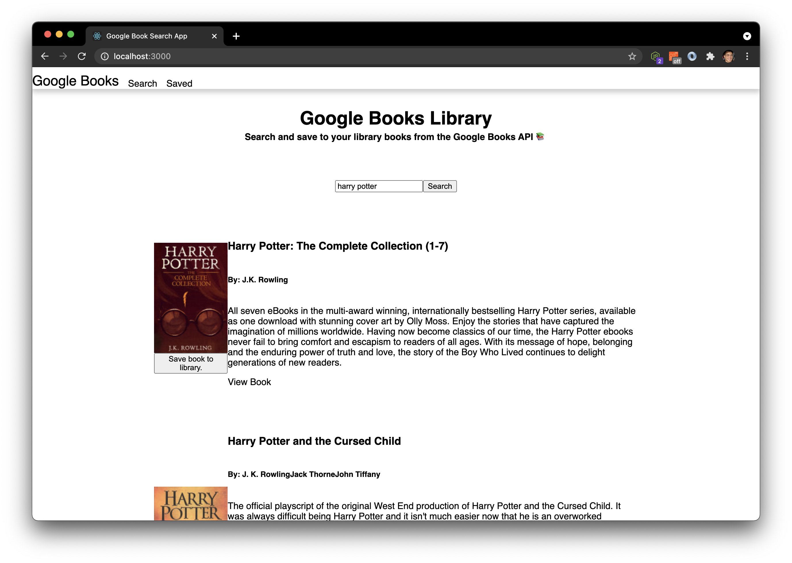

# Google Books Library
## Description
Basic library application enabled by Google Books API, Reactm and MongoDB. User can search Google Books, save books to their personal library, and view the collection of saved books in their library.

## Table of Contents
- [Description](#Description)
- [Deployment](#Deployment)
- [Features](#Features)
- [Credits](#Credits)
- [Contributing](#Contributing)
- [License](#License)
  

## Deployment
- [Heroku Deployment](https://morning-harbor-85685.herokuapp.com/)
- [GitHub Repo](https://github.com/jareddeuriarte/google-books)
  

  

### Technologies
- React
- Node.js technology
- Express
- MongoDB & Mongoose framework
- Google Books API

### Credits  
My tutor Namita.

### Contributing
Forks are welcome!

### License 
This project is licensed under MIT.

### Badges

### Questions?
Reach me at:
- [GitHub](https://github.com/jareddeuriarte)
- deuriartejared@gmail.com

